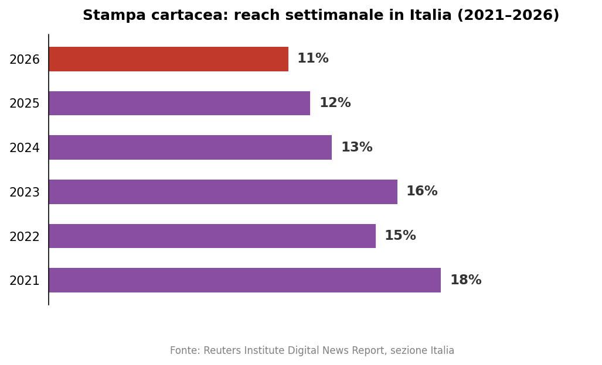
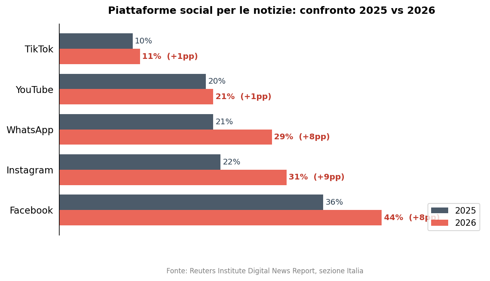
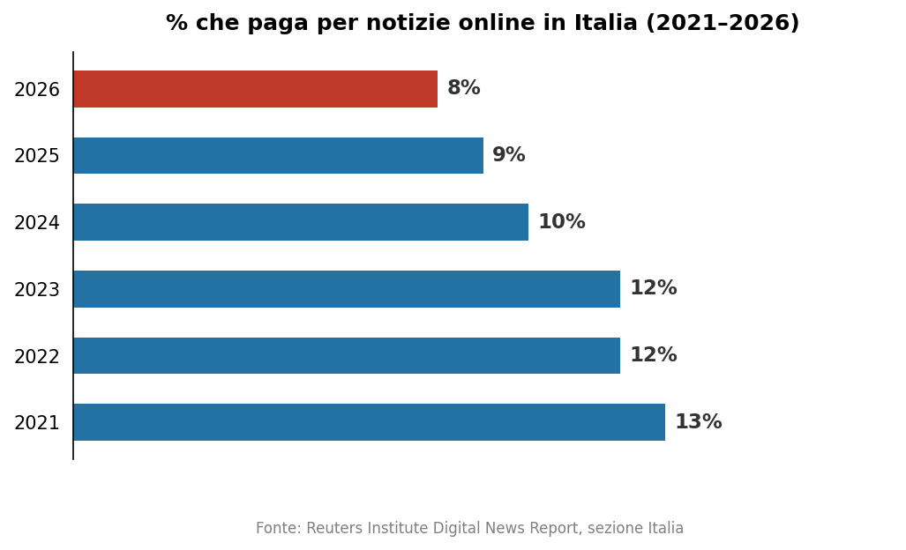
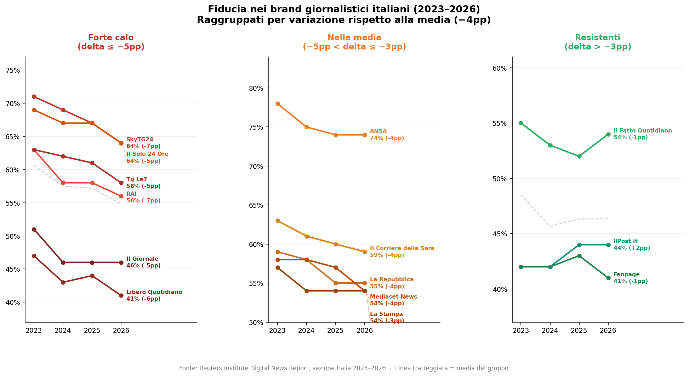
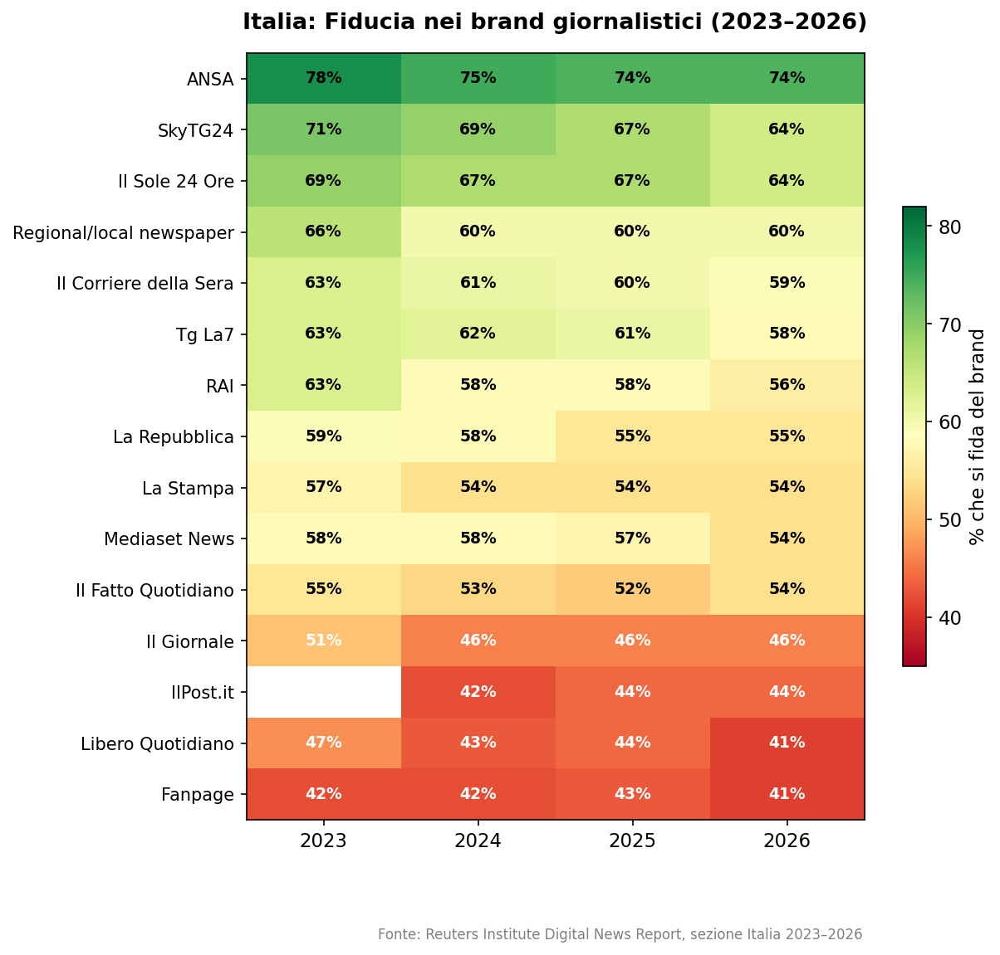
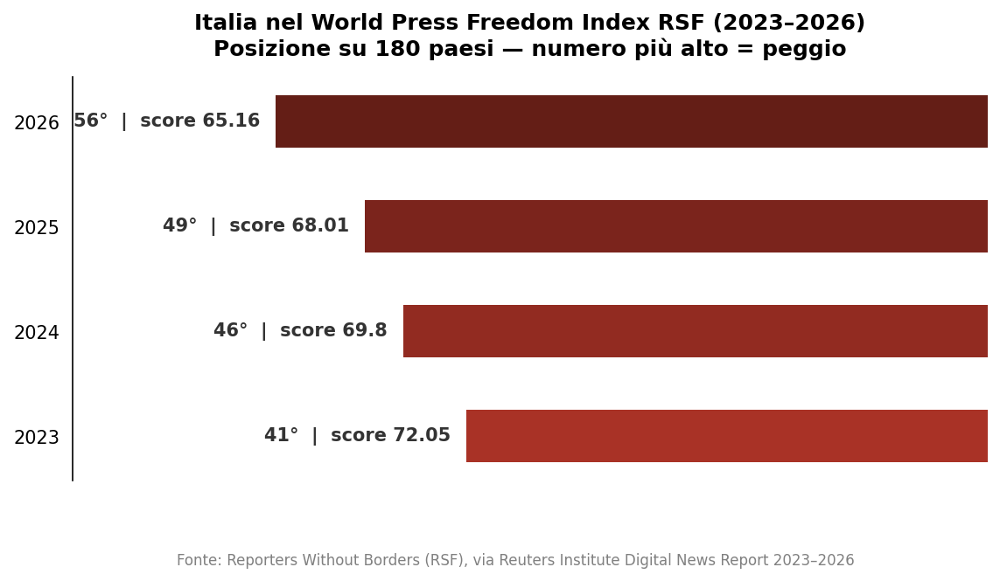

# L'informazione in Italia sta cambiando pelle: cinque anni di trasformazione raccontati dai dati

*Un'analisi basata sui Reuters Institute Digital News Report 2021–2026, sezione Italia*

---

> Ogni anno il Reuters Institute for the Study of Journalism di Oxford pubblica il Digital News Report, la più ampia ricerca comparativa al mondo sui comportamenti dei lettori di notizie. Questo articolo analizza esclusivamente i dati relativi all'Italia, confrontando i risultati dal 2021 al 2026 per tracciare un quadro di come stia cambiando il modo in cui gli italiani si informano.

---

## 1. La fiducia non è mai tornata

Cominciamo dalla cifra più scomoda.

Nel 2021, dopo il crollo di fiducia registrato durante la pandemia, il numero di italiani che dichiarava di fidarsi "di quasi tutte le notizie quasi tutto il tempo" era risalito al **40%** — un rimbalzo di 11 punti rispetto al 2020. Sembrava l'inizio di una ripresa. Non lo era.

Nei cinque anni successivi, la fiducia ha percorso una traiettoria lenta ma inesorabile verso il basso: 35% nel 2022, poi 34% per due anni consecutivi (2023 e 2024), una lieve risalita al 36% nel 2025, e poi il nuovo minimo: **32% nel 2026**, con un calo di 4 punti in un solo anno.

📊 *[Grafico 1: Fiducia, stampa e pagamento per le notizie 2021–2026]*

La media globale nel 2026 è al 37%. L'Italia è sotto.

Quello che cambia nel tono del rapporto 2026 rispetto agli anni precedenti non è solo il numero, ma la spiegazione: i report precedenti attribuivano la bassa fiducia alla **partisanship dei singoli brand** — testate percepite come troppo schierate. Dal 2026, il rapporto descrive esplicitamente un **ambiente mediatico "altamente polarizzato"** in cui la sfiducia non riguarda più questo o quel giornale, ma il sistema dell'informazione nel suo complesso. I brand percepiti come più neutrali ottengono punteggi più alti, ma l'effetto di trascinamento al ribasso è generale.

ANSA rimane il brand più fidato in Italia per tutti e sei gli anni considerati — con un margine netto sugli altri. Nel 2026 al 74%, contro il 78% del 2023. Anche i brand più solidi perdono terreno.

---

## 2. La stampa non ha trovato il fondo

La carta stampata in Italia non è in crisi. È in declino strutturale, e i dati lo mostrano senza ambiguità.

📊 *[Grafico T1: Stampa cartacea — reach settimanale 2021–2026]*

In cinque anni, la quota di italiani che usa la stampa cartacea per informarsi almeno una volta alla settimana è scesa dal 18% all'11%. Quasi la metà. Il rapporto 2024 notava che le edicole italiane sono scese a circa 13.500 — 2.700 in meno in quattro anni. Dal 2024, i bandi pubblici non sono più obbligati per legge a essere pubblicati sui giornali: una perdita stimata di circa 40 milioni di euro annui per il settore.

Il mercato pubblicitario digitale non compensa. Anzi: le piattaforme tech catturano oltre l'**85% dei ricavi pubblicitari digitali** in Italia — una percentuale stabile da anni, che equivale a dire che ogni euro di crescita del digitale va quasi per intero a Google e Meta, non agli editori.

📊 *[Grafico 2: Reach settimanale per fonte di notizie 2021–2026]*

La televisione tiene meglio: dal 76% di reach settimanale del 2021 al 62% del 2026, con un declino più lento. Ma anche qui la direzione è chiara, e i broadcaster tradizionali devono fare i conti con lo streaming, che nel 2026 cattura oltre il 21% dei ricavi TV totali in Italia (Netflix, DAZN, Amazon, Disney).

---

## 3. La pagina GEDI: sei anni, una storia di dismissioni

Se volete capire com'è cambiata la proprietà dei media italiani, basta seguire le vicende di GEDI — il gruppo che pubblica La Repubblica e La Stampa.

**2021**: La famiglia Agnelli-Elkann (il più grande azionista di Stellantis) acquista il controllo di GEDI dalla famiglia De Benedetti. Nuovo direttore a Repubblica. Dimissioni di giornalisti di punta.

**2022**: GEDI vende L'Espresso — la storica rivista settimanale — e acquisisce il 30% di Stardust, una società di influencer marketing. La svolta verso il digitale social è esplicita.

**2023**: Nuove vendite di giornali locali. I giornalisti di Repubblica scioperano contro la nuova linea editoriale, accusata di aver ammorbidito il tradizionale orientamento centre-left del giornale.

**2024**: Continuano le dismissioni. GEDI acquisisce cronachedispogliatoio.it, un outlet basato sulla distribuzione social. La priorità è il traffico, non la carta.

**2025**: Vende Provincia Pavese, ultima delle testate locali storiche. Il Garante della Privacy emette un avviso su una potenziale partnership con OpenAI (ChatGPT avrebbe accesso ai contenuti GEDI, GEDI avrebbe i suoi articoli usati per migliorare i modelli). Nuovo cambio di direttore a Repubblica.

**2026**: **GEDI viene venduta al 100% al gruppo greco Antenna**, controllato dalla famiglia Kyriakou. Il deal include Repubblica, HuffPost Italia, Radio Deejay, Radio Capital, National Geographic Italia. La Stampa era già stata venduta separatamente all'editore regionale SAE. Per la prima volta, il principale gruppo editoriale progressista italiano è in mano straniera.

Questa non è solo una storia di proprietà. È la storia di come la crisi strutturale del settore abbia reso insostenibile il modello storico, e di come la risposta degli editori sia stata un mix di dismissioni, pivot verso il digitale-social e concentrazione di risorse sulle testate di punta.

---

## 4. I social: un ciclo che si è riaperto

Uno dei dati più sorprendenti del rapporto 2026 riguarda i social media.

Tra il 2021 e il 2025, l'uso dei social per le notizie in Italia aveva percorso una traiettoria di declino quasi continuo: Facebook per le notizie era passato dal 50% al 36%, WhatsApp dal 30% al 21%, i social media in generale dal 47% al 39%. Sembrava una tendenza strutturale: gli italiani si stavano allontanando dai social come fonte di informazione.

Poi, nel 2026, la tendenza si inverte bruscamente.

📊 *[Grafico 3: Uso delle principali piattaforme per le notizie 2021–2026]*

📊 *[Grafico T2: Piattaforme social per le notizie — confronto 2025 vs 2026]*

Il rapporto stesso lo descrive così: "After an 11pp fall since 2020, social media use for news is up 6pp." Non spiega le ragioni, ma il dato è netto. È possibile che eventi politici rilevanti nel periodo considerato (il referendum costituzionale del marzo 2026, le tensioni geopolitiche) abbiano spinto le persone a cercare informazioni anche su canali social. È anche possibile che l'algoritmo di Meta abbia favorito il contenuto informativo in quel periodo.

Quello che è certo è che **Instagram è la piattaforma che cresce di più** (+9pp in un anno), sorpassando per la prima volta WhatsApp come seconda fonte social per le notizie.

Parallelamente, Twitter/X scompare dalla top 6 dei social usati per le notizie. Era presente al 8% nel 2021 e nel 2022. Dal 2023 non compare più tra le prime sei piattaforme.

📊 *[Grafico 4: Piattaforme emergenti — TikTok, Telegram, Twitter/X]*

TikTok cresce lentamente ma in modo costante: 8% nel 2023, poi 9%, 10%, 11% nel 2026. Non è ancora una fonte primaria di notizie per gli italiani, ma la traiettoria è univoca.

---

## 5. Chi paga, chi condivide, chi evita

Tre comportamenti che dicono molto su come gli italiani si rapportano all'informazione.

**Chi paga.** La percentuale di italiani che paga per le notizie online non è mai cresciuta in modo significativo e ha continuato a scendere:

📊 *[Grafico T3: % che paga per notizie online 2021–2026]*

Questo nonostante anni di sforzi degli editori per convincere i lettori a sottoscrivere abbonamenti. Il Corriere della Sera aveva raggiunto 508.000 abbonati digitali nel 2022–2023. Il Post ha sviluppato un modello di membership solido. Fanpage ha lanciato la sua nel 2025. Eppure la quota di italiani che paga resta la più bassa del periodo osservato.

**Chi condivide.** La percentuale di chi condivide notizie via social, messaggistica o email è scesa dal 40% del 2021 al 26% del 2025 (2024 e 2026 non disponibili). La tendenza suggerisce un consumo sempre più passivo delle notizie: si leggono, ma non si rilanciano.

**Chi evita.** Il 2026 introduce per la prima volta un dato esplicito sulla *news avoidance* per l'Italia: **il 36% degli italiani evita le notizie spesso o a volte**, in aumento di 3 punti percentuali. Questo dato va letto insieme al calo di fiducia: evitare le notizie è spesso una risposta all'ansia, alla sfiducia, o alla sensazione che informarsi non cambi nulla.

📊 *[Grafico 7: Condivisione e ascolto podcast 2021–2025]*

---

## 6. La fiducia nei brand: chi perde di più

La tabella di fiducia nei singoli brand è disponibile con dati completi dal 2023 al 2026. La tendenza generale è di calo quasi universale.

Alcuni pattern rilevanti:

- **ANSA** rimane stabile al 74–78%: la fonte percepita come più neutrale e professionale.
- **SkyTG24** scende dal 71% al 64% in tre anni.
- **Il Sole 24 Ore** scende dal 69% al 64%.
- **RAI** scende dal 63% al 56% — un calo significativo per il servizio pubblico.
- **Tg La7** scende dal 63% al 58%.
- **La Repubblica** scende dal 59% al 55% — stabile negli ultimi due anni, ma il percorso dal 2023 è in discesa.
- **Fanpage** e **Libero Quotidiano** restano i meno fidati (41% nel 2026), con i livelli più alti di sfiducia attiva (rispettivamente 29% e 27% "non mi fido").

Per i brand progressisti come Repubblica, il calo potrebbe riflettere l'impatto dei cambiamenti editoriali avvenuti dal 2021 in poi — i lettori storici hanno percepito una discontinuità.

---

## 7. La libertà di stampa che peggiora ogni anno

Il World Press Freedom Index di Reporters Without Borders è incluso nei report solo dal 2023. Ma i quattro anni disponibili mostrano una traiettoria preoccupante.

📊 *[Grafico 5: Libertà di stampa RSF 2023–2026]*

📊 *[Grafico T4: World Press Freedom Index RSF 2023–2026]*

In tre anni, l'Italia ha perso 15 posizioni nel ranking. Ogni anno peggiore del precedente.

---

## 8. L'Italia come laboratorio: AI, piattaforme e nuovi attori

Il rapporto 2026 dedica ampio spazio al ruolo dell'Italia come **banco di prova europeo** per la regolazione dell'ecosistema informativo.

**AGCOM vs. piattaforme.** Nel 2025, AGCOM (l'autorità regolatoria italiana) ha stabilito la "equa remunerazione" dovuta da Meta a GEDI per l'uso delle pubblicazioni giornalistiche — una cifra stimata tra i 9 e i 10 milioni di euro. Meta ha impugnato la decisione; il tribunale italiano ha rinviato il caso alla Corte di Giustizia UE. Nel febbraio 2026, il presidente AGCOM ha annunciato l'intenzione di segnalare Google AI Mode alla Commissione Europea per il suo impatto sulla libertà d'informazione.

**L'AI entra nel radar.** La legge nazionale italiana sull'AI è stata approvata alla fine del 2025, introducendo un framework su danni, copyright e usi di training. Il 6% degli italiani usa AI chatbot per le notizie nel 2026 (+2pp rispetto al 2025, quando il dato veniva misurato per la prima volta).

**Influencer e creator.** Nel luglio 2025 AGCOM ha adottato un codice di condotta per gli influencer "significativi". Nel referendum costituzionale del marzo 2026, la premier Meloni ha scelto di apparire su *Pulp Podcast*, condotto da un rapper e YouTuber popolare. Substack guadagna terreno tra i giornalisti affermati: le newsletter a pagamento di Stefano Feltri e Selvaggia Lucarelli hanno costruito rapidamente audience consistenti.

---

## 9. Lo snapshot: cosa è cambiato davvero in cinque anni

📊 *[Grafico 8: Confronto 2021 vs 2026 — principali indicatori]*

Cinque anni sono pochi per le grandi trasformazioni culturali, ma abbastanza per misurare direzione e velocità del cambiamento. In Italia:

- La **fiducia nelle notizie** è scesa di 8 punti percentuali (da 40% a 32%).
- La **stampa cartacea** ha perso quasi metà della sua audience settimanale (da 18% a 11%).
- **Facebook** per le notizie è sceso complessivamente di 6 punti (da 50% a 44%), nonostante il rimbalzo 2026.
- **Instagram** per le notizie è più che raddoppiata (da 15% a 31%).
- Chi **paga per le notizie online** è sceso di 5 punti (da 13% a 8%).
- I **social media** per le notizie sono scesi dal 47% al 45% — con un crollo intermedio fino al 39% e poi rimbalzo.
- La **libertà di stampa** è peggiorata ogni anno disponibile.

Quello che non era prevedibile nel 2021:
- Che GEDI sarebbe passata di mano due volte e finisse a un gruppo greco.
- Che Twitter/X sarebbe scomparso dalla top 6 dei social per le notizie.
- Che Instagram avrebbe superato WhatsApp come fonte social per l'informazione.
- Che l'Italia sarebbe diventata il campo di battaglia europeo sulla remunerazione delle piattaforme.
- Che Substack avrebbe trovato spazio tra i giornalisti italiani più noti.

---

## Metodologia

### Fonti primarie

L'analisi si basa esclusivamente sui **Reuters Institute Digital News Report** edizioni 2021, 2022, 2023, 2024, 2025 e 2026, pubblicati dal Reuters Institute for the Study of Journalism dell'Università di Oxford. Le sezioni Italia di ciascun report sono curate da Alessio Cornia (Dublin City University). I PDF originali non sono distribuiti con questo lavoro in quanto materiale copyrightato.

### Estrazione del testo

Il testo è stato estratto dai PDF tramite la libreria Python **PyMuPDF (fitz)**, pagina per pagina, con un'unica passata per documento. L'output grezzo è stato salvato in formato Markdown strutturato (cartella `extracted/`), con intestazioni di secondo livello (`## NomePaese`) generate automaticamente rilevando il pattern `Digital News Report YYYY | NomePaese` nel testo estratto.

Le pagine originali della sola sezione Italia (narrativa + datasheet, 2 pagine per anno) sono state estratte anche come PDF autonomi nella cartella `pdf-italia/`, identificate cercando le stringhe `"ITALY"` + `"Population"` e delimitando la sezione fino all'inizio del paese successivo (Paesi Bassi in tutti gli anni considerati).

### Parsing e costruzione dei dataset

I dati numerici sono stati estratti con lettura manuale assistita del testo estratto, seguendo questo criterio per ciascun indicatore:

**Dati confermati da testo narrativo** (priorità massima): valori citati esplicitamente nel testo descrittivo della sezione Italia, ad esempio `"print is at just 11%"` o `"Trust in news has fallen further [...] at 32%"`. Questi dati sono considerati certi.

**Dati confermati da tabelle strutturate**: le tabelle di brand trust (% Trust / Neither / Don't Trust) sono presenti come testo tabulare nel PDF dal 2023 in poi e sono state estratte con un parser regex che identifica la sequenza `[nome brand] → [XX%] → [XX%] → [XX%]`. Per il 2021 e 2022 le tabelle non erano recuperabili in forma strutturata dall'estrazione testuale.

**Dati derivati da grafici PDF** (priorità minore): i valori di reach settimanale aggregati per fonte (TV, qualsiasi online, social media) compaiono nel PDF come elementi grafici. Dall'estrazione testuale emergono come sequenze di percentuali non etichettate. L'attribuzione è stata fatta per inferenza contestuale: la sequenza `[TV%] [online%] [print%] [social%]` è stata identificata confrontando il valore di stampa cartacea (confermato da testo narrativo ogni anno) con la sua posizione nella sequenza, poi attribuendo le altre posizioni per coerenza. Questi valori sono indicati nel dataset con una nota.

I dataset puliti sono disponibili nella cartella `data/csv/`:
- `indicators_over_time.csv` — fiducia, fonti, pay, condivisione (2021–2026)
- `platforms_for_news.csv` — uso settimanale per piattaforma (2021–2026)
- `brand_trust.csv` — fiducia per brand (2023–2026)
- `press_freedom.csv` — ranking e score RSF (2023–2026)

### Limiti e avvertenze

**Comparabilità temporale.** Il survey è condotto annualmente su campioni indipendenti (circa 2.000 rispondenti per l'Italia). Le variazioni anno su anno riflettono differenze campionarie oltre che tendenze reali. Il rapporto 2026 segnala che i dati italiani derivano da un *repoll* condotto nel marzo 2026 con un campione ridotto a 1.000 rispondenti, il che può influire sulla comparabilità con gli anni precedenti.

**Brand trust: copertura parziale.** La lista di brand testati non è esaustiva né costante: `IlPost.it` compare per la prima volta nel 2024; `Porta a Porta` è presente solo nel 2023. Il delta di IlPost.it nei grafici è calcolato sul periodo 2024–2026, non 2023–2026 come per gli altri brand.

**Dati mancanti.** La percentuale di chi condivide notizie non è disponibile per il 2024 e il 2026 (layout del datasheet modificato). Il dato di *news avoidance* per l'Italia è esplicitato solo dal 2026. L'ascolto podcast è misurato come consumo mensile fino al 2024, poi cambia in uso settimanale specifico per podcast di notizie: le due serie non sono direttamente confrontabili.

**TV e online reach aggregati.** I valori di reach settimanale per TV e "qualsiasi online" sono derivati da grafici PDF e non da testo narrativo. Sono coerenti con le descrizioni qualitative presenti in ogni edizione ma vanno trattati come stime.

### Visualizzazioni

I grafici sono stati generati con **matplotlib** (Python) a partire dai dataset CSV. Il codice completo è disponibile in `data/build_datasets_and_charts.py`. Il raggruppamento dei brand giornalistici nei tre panel (forte calo / nella media / resistenti) è basato sulla variazione 2023→2026 rispetto alla media del gruppo (−4pp): forte calo ≤ −5pp, nella media tra −3pp e −5pp, resistenti > −3pp.

### Riproducibilità

Il repository pubblico `github.com/nelsonmau/DNR-trendItalia` contiene tutti gli script, i dataset CSV, i grafici e i testi estratti. I PDF originali non sono inclusi. Per riprodurre l'estrazione è necessario disporre dei PDF originali e di Python 3 con le librerie `pymupdf` e `matplotlib`.

---

*Fonti primarie: Reuters Institute Digital News Report 2021, 2022, 2023, 2024, 2025, 2026 — sezione Italia. Autore delle sezioni Italia: Alessio Cornia, Dublin City University.*
